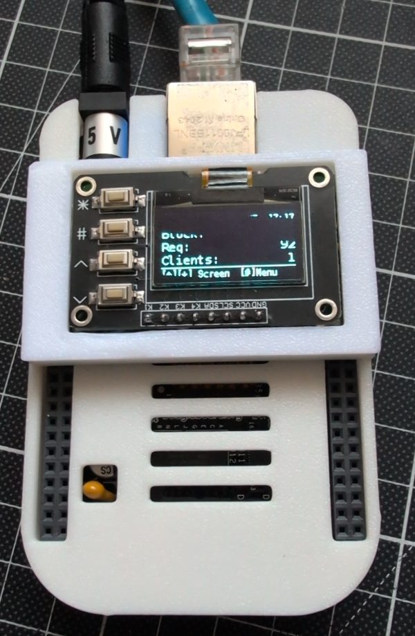
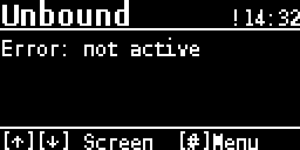
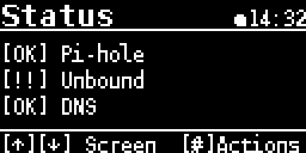
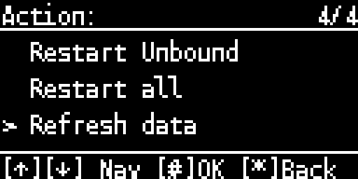
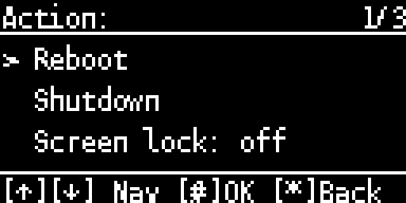
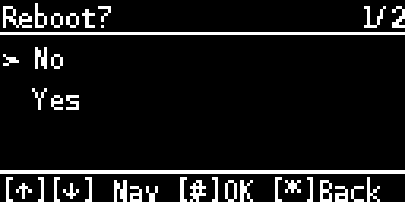
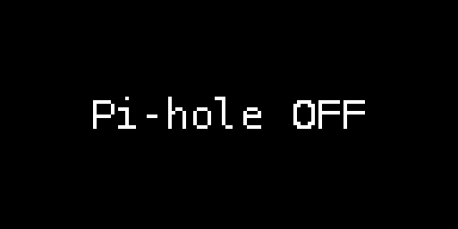
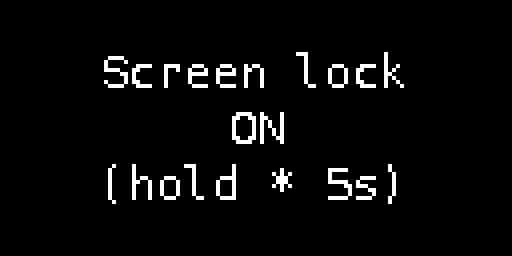

# pihole-display

<p align="center">
  
</p>

OLED display controller for a **BeagleBone Black** running **Pi-hole** and **Unbound**.  
Shows DNS filter statistics, system info and allows basic control via 4 hardware buttons.

## Hardware

- Component: SBC
  Details: BeagleBone Black (Debian 13 Trixie)
- Component: Display
  Details: 0.96" OLED SSD1315, 128x64, I2C
- Component: Buttons
  Details: 4x directly wired (K1-K4), 4.7K pull-up on board
- Component: Interface
  Details: I2C2 (P9_19 SCL, P9_20 SDA) + 4x GPIO (P8_7-P8_10)

### Wiring

```text
Display Pin  →  BBB Pin     Function
───────────────────────────────────────
GND          →  P9 Pin 2    Ground
VCC          →  P9 Pin 4    3.3V
SCL          →  P9 Pin 19   I2C2 SCL
SDA          →  P9 Pin 20   I2C2 SDA
K1  (v)      →  P8 Pin 7    gpiochip1 line 2
K2  (^)      →  P8 Pin 8    gpiochip1 line 3
K3  (#)      →  P8 Pin 9    gpiochip1 line 5
K4  (*)      →  P8 Pin 10   gpiochip1 line 4
```

The display is mounted rotated by 180° (`DISPLAY_ROTATE = 2`), so K2 is
up and K1 is down.

**-> Detailed wiring guide with perfboard adapter: [docs/WIRING_GUIDE.md](docs/WIRING_GUIDE.md)**

## Screens

- Pi-hole
  Description: Block %, queries, clients
  Action key (#): Pause / disable / gravity menu
- Unbound
  Description: Cache hit %, Q/s, total
  Action key (#): Cache / restart menu
- Network
  Description: IP, gateway, hostname, uptime
  Action key (#): -
- System
  Description: CPU %, temp, RAM, disk (temp shows `--` without a sensor,
  the BBB kernel has none)
  Action key (#): Reboot / shutdown / screen lock menu
- Status
  Description: Service health overview
  Action key (#): Actions menu

### Button layout

```text
K2 (^)  short  → previous screen / menu up
K1 (v)  short  → next screen     / menu down
K3 (#)  short  → open action menu / confirm
K4 (*)  short  → home screen     / cancel
K2 (^)  long   → force data refresh
K1 (v)  long   → toggle display sleep
K4 (*)  long   → home screen
K4 (*)  hold 5s → wake the display while the screen lock is on
```

The display sleeps after `DISPLAY_TIMEOUT` without input. Any button
wakes it, unless the screen lock is on: then only holding * for 5 seconds
does. The System menu (#) offers reboot, shutdown and the screen lock
toggle, each with a yes/no confirmation. The lock setting is kept in
`/var/lib/pihole-display/state.json`.

## Mockups

> All screens rendered at 4× scale (actual display: 128×64 px)

<details>
<summary>Show all screen mockups</summary>

### Main screens

- Splash:

  

- Pi-hole active:

  

- Pi-hole paused:

  

- Pi-hole off:

  

- Unbound:

  

- Unbound (error):

  

- Network:

  

- System:

  

- Status:

  

- Status (error):

  

### Menus

- Pi-hole menu:

  

- Pi-hole menu (scrolled):

  

- Pi-hole menu (off):

  

- Unbound menu:

  

- Status actions:

  

- Status actions (scrolled):

  

- System menu:

  

- Confirmation (reboot):

  

### Status messages

- Pause:

  

- Active:

  

- Off:

  

- Flush:

  

- Gravity update:

  

- Reboot:

  

- Screen lock on:

  

</details>

## Enclosure

[`stl/BBB_Cover.stl`](stl/BBB_Cover.stl) is a printable cover that frames the
OLED display (58 × 35 × 6.5 mm). It is designed to go with the
[BeagleBone Black Case with Ventilation](https://www.thingiverse.com/thing:1644922)
by MandyRae on Thingiverse.

## Installation

### Prerequisites: Pi-hole and Unbound

pihole-display expects Pi-hole v6 with Unbound as its local upstream resolver
on the BBB. Set both up first with the official Pi-hole documentation:

- [Pi-hole prerequisites](https://docs.pi-hole.net/main/prerequisites/)
- [Pi-hole installation](https://docs.pi-hole.net/main/basic-install/)
- [Unbound as a recursive DNS server for Pi-hole](https://docs.pi-hole.net/guides/dns/unbound/)

### Install pihole-display

```bash
# Copy to BeagleBone Black (root login is disabled on the BeagleBoard images)
scp -r pihole-display/ <user>@<BBB_IP_ADDRESS>:/tmp/

# On the BBB
cd /tmp/pihole-display
sudo ./install.sh

# Verify I2C (should show 3c, or 3d if the address bridge is set)
sudo i2cdetect -y -r 2

# Start
sudo systemctl start pihole-display
sudo journalctl -u pihole-display -f
```

The Unbound screen reads its stats with `unbound-control`, which Debian ships
disabled. `install.sh` offers to enable it (this restarts Unbound, so DNS is
briefly unavailable for the network). To do it manually, through a local
socket without certificates:

```bash
sudo cp /etc/unbound/unbound.conf.d/remote-control.conf.dpkg-dist \
        /etc/unbound/unbound.conf.d/remote-control.conf
sudo unbound-checkconf && sudo systemctl restart unbound
```

## Configuration

Edit `pihole-display/config.py` before installation, or later
`/opt/pihole-display/config.py` followed by
`sudo systemctl restart pihole-display`:

```python
I2C_PORT         = 2           # /dev/i2c-2
I2C_ADDRESS      = 0x3C        # or 0x3D
DISPLAY_ROTATE   = 2           # 180°, display mounted upside down
PIHOLE_HOST      = 'localhost' # Pi-hole host
PIHOLE_PASSWORD  = ''          # Pi-hole v6; empty = log in with /etc/pihole/cli_pw
REFRESH_INTERVAL = 10          # seconds
DISPLAY_TIMEOUT  = 60          # seconds until sleep (0 = never)
HOLD_MS          = 5000        # hold * this long to wake a locked display
```

With `PIHOLE_PASSWORD` empty, the service logs in with Pi-hole's local CLI
password file, so no password has to be stored in `config.py`.

## Project structure

```text
pihole-display/
├── config.py              — pins, I2C bus, timing
├── data.py                — Pi-hole API v5/v6, Unbound, system stats
├── display_manager.py     — OLED screens + menu system (luma.oled)
├── button_handler.py      — GPIO buttons (gpiod v2 + sysfs fallback)
├── main.py                — main loop + event handling
├── version.py             — version number (shown in the System header)
├── requirements.txt       — Python dependencies
├── pihole-display.service — systemd unit
└── install.sh             — installation script

docs/
├── WIRING_GUIDE.md        — wiring, verification, troubleshooting
├── generate_mockups.py    — renders all screens as PNG (run on the BBB)
├── mockups/               — rendered screen mockups
└── kicad/                 — KiCad PCB for the cape

stl/
└── BBB_Cover.stl          — printable cover around the OLED display
```

## Dependencies

- [luma.oled](https://github.com/rm-hull/luma.oled)
  Version: >= 3.13
  License: MIT
  Purpose: OLED driver (SSD1306/SSD1315)
- [Pillow](https://python-pillow.org/)
  Version: >= 12.1.1
  License: MIT-CMU
  Purpose: Image/text rendering
- [psutil](https://github.com/giampaolo/psutil)
  Version: >= 5.9
  License: BSD-3
  Purpose: System stats (CPU, RAM, disk)
- [requests](https://docs.python-requests.org/)
  Version: >= 2.33.0
  License: Apache-2.0
  Purpose: Pi-hole API calls
- [python-gpiod](https://git.kernel.org/pub/scm/libs/libgpiod/libgpiod.git/)
  Version: system
  License: LGPL-2.1
  Purpose: GPIO button reading

System packages (installed by `install.sh`): `python3-venv`,
`python3-libgpiod`, `gpiod`, `i2c-tools`, `libi2c-dev`, `fonts-dejavu-core`

## License

MIT — see [LICENSE](LICENSE)
