# pihole-display

OLED display controller for a **BeagleBone Black** running **Pi-hole** and **Unbound**.  
Shows DNS filter statistics, system info and allows basic control via 4 hardware buttons.

## Hardware

- Component: SBC
  Details: BeagleBone Black (Debian 13 Trixie)
- Component: Display
  Details: 0.96" OLED SSD1315, 128x64, I2C
- Component: Buttons
  Details: 4x directly wired (K1-K4), 4.7K pull-up on board
- Component: Interface
  Details: I2C2 (P9_19 SCL, P9_20 SDA) + 4x GPIO (P8_7-P8_10)

### Wiring

```text
Display Pin  →  BBB Pin     Function
───────────────────────────────────────
GND          →  P9 Pin 1    Ground
VCC          →  P9 Pin 3    3.3V
SCL          →  P9 Pin 19   I2C2 SCL
SDA          →  P9 Pin 20   I2C2 SDA
K1  (^)      →  P8 Pin 7    GPIO2_2
K2  (v)      →  P8 Pin 8    GPIO2_3
K3  (#)      →  P8 Pin 9    GPIO2_5
K4  (*)      →  P8 Pin 10   GPIO2_4
```

**-> Detailed wiring guide with perfboard adapter: [docs/WIRING_GUIDE.md](docs/WIRING_GUIDE.md)**

## Screens

- Pi-hole
  Description: Block %, queries, clients
  Action key (#): Pause / disable menu
- Unbound
  Description: Cache hit %, Q/s, total
  Action key (#): Flush cache
- Network
  Description: IP, gateway, hostname, uptime
  Action key (#): -
- System
  Description: CPU %, temp, RAM, disk
  Action key (#): -
- Status
  Description: Service health overview
  Action key (#): Restart menu

### Button layout

```text
K1 (^)  short  → previous screen / menu up
K2 (v)  short  → next screen     / menu down
K3 (#)  short  → open action menu / confirm
K4 (*)  short  → home screen     / cancel
K1 (^)  long   → force data refresh
K2 (v)  long   → toggle display sleep
```

## Mockups

> All screens rendered at 4× scale (actual display: 128×64 px)

### Main screens

- Splash: 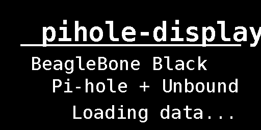
- Pi-hole active: 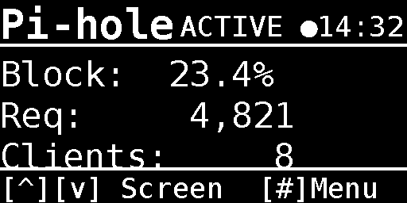
- Pi-hole paused: 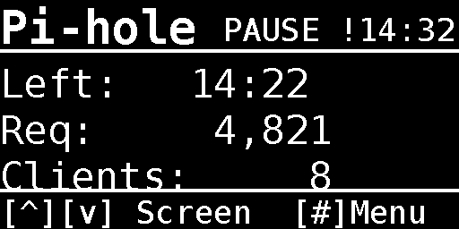
- Pi-hole off: 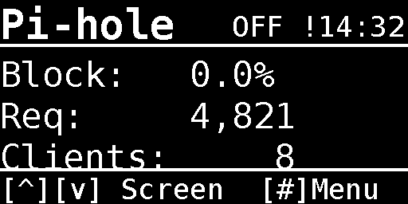

- Unbound: 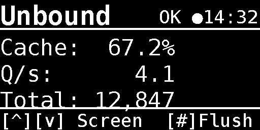
- Network: 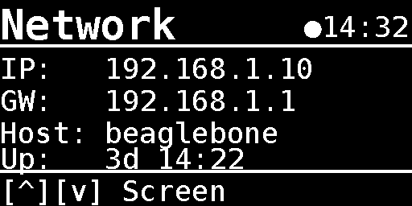
- System: 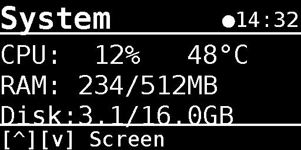
- Status: 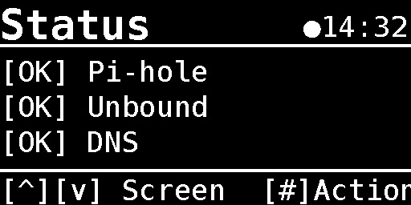

### Menus

- Pi-hole menu: 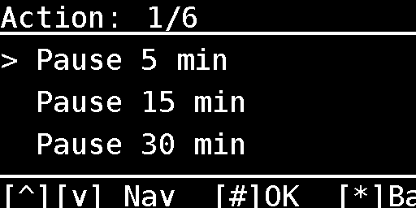
- Scrolled: 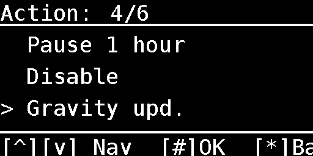
- Pi-hole off: 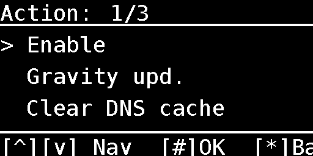
- Unbound: 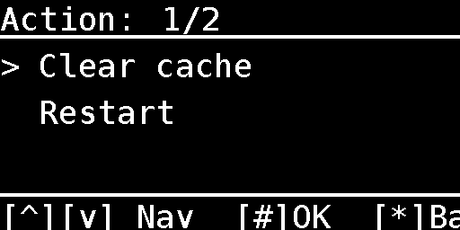
- Status actions: 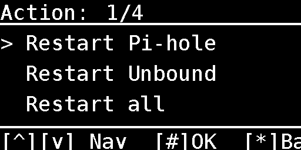

### Status messages

- Pause: 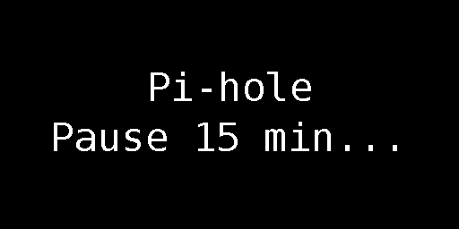
- Active: 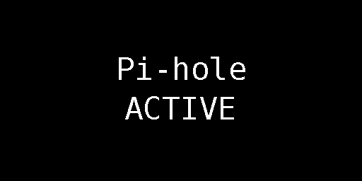
- Flush: 
- Gravity update: 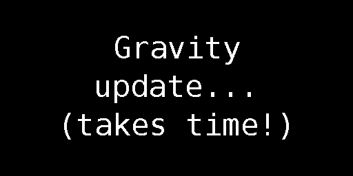

## Installation

```bash
# Copy to BeagleBone Black
scp -r pihole-display/ root@beaglebone:/tmp/

# On the BBB
cd /tmp/pihole-display
sudo ./install.sh

# Verify I2C (should show 0x3C or 0x3D)
i2cdetect -y -r 2

# Start
sudo systemctl start pihole-display
sudo journalctl -u pihole-display -f
```

## Configuration

Edit `pihole-display/config.py` before installation:

```python
I2C_PORT       = 2        # /dev/i2c-2
I2C_ADDRESS    = 0x3C     # or 0x3D
PIHOLE_PASSWORD = ''      # Pi-hole v6 only
REFRESH_INTERVAL = 10     # seconds
DISPLAY_TIMEOUT  = 60     # seconds until sleep (0 = never)
```

## Project structure

```text
pihole-display/
├── config.py              — pins, I2C bus, timing
├── data.py                — Pi-hole API v5/v6, Unbound, system stats
├── display_manager.py     — OLED screens + menu system (luma.oled)
├── button_handler.py      — GPIO buttons (gpiod v2 + sysfs fallback)
├── main.py                — main loop + event handling
├── requirements.txt       — Python dependencies
├── pihole-display.service — systemd unit
└── install.sh             — installation script

docs/
├── generate_mockups.py    — renders all screens as PNG
└── mockups/               — rendered screen mockups
```

## Dependencies

- [luma.oled](https://github.com/rm-hull/luma.oled)
  Version: >= 3.13
  License: MIT
  Purpose: OLED driver (SSD1306/SSD1315)
- [Pillow](https://python-pillow.org/)
  Version: >= 12.1.1
  License: HPND
  Purpose: Image/text rendering
- [psutil](https://github.com/giampaolo/psutil)
  Version: >= 5.9
  License: BSD-3
  Purpose: System stats (CPU, RAM, disk)
- [requests](https://docs.python-requests.org/)
  Version: >= 2.33.0
  License: Apache-2.0
  Purpose: Pi-hole API calls
- [python-gpiod](https://git.kernel.org/pub/scm/libs/libgpiod/libgpiod.git/)
  Version: system
  License: LGPL-2.1
  Purpose: GPIO button reading

System packages: `i2c-tools`, `fonts-dejavu-core`

## License

MIT — see [LICENSE](LICENSE)
